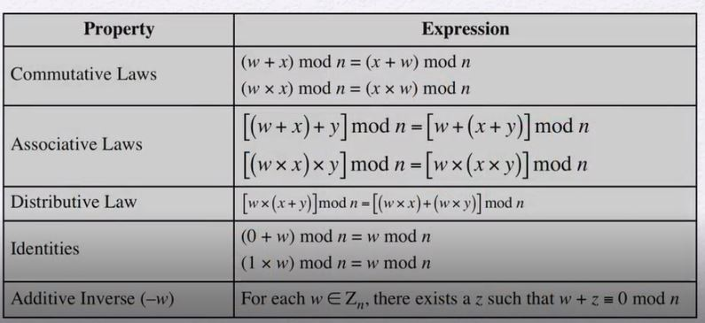

# CH 02 Number Theory

[toc]

## Divisibility

- Definition ：
  - a nonzero b **divides** a if $a = mb$ for some m,where a,b and m are integers.
  - b divides a if there is no remainder on division
- Notation : 
  - $b\ | \ a$ --- b divides a and b is **divisor** of a

- Example:
  - The positive divisors of 24 are 1,2,3,4,6,8,12 and 24
  - $13\ | \ 182 ; \ -5\ | \ 30; \ 17\ | \ 289; \ -3 \ | \ 33;\ 17\ | \ 0$

### Properties of Divisibility

- If $ \ a \ | \ 1$, then $a \ = \pm 1$ 

- If $a \ |\ b$, then $ a = \pm b$

- Any $ b\ \ne \ 0$ divides 0

- If $a\ | \ b$ and $b\ |\ c$,then $a\ | \ c$

  - e.g., $11\ |\ 66$ and $66\ |\ 198$ = $11\ |\ 198$

- If $b\ |\ g$ and $b\ |\ h$,then $b\ |\ (mg+nh)$ for arbitrary integers m and n

  > Demonstrate：
  >
  > 
  >
  > If $b\ |\ g$,then g is of the form $g = b*g_1$ for some integer $g_1$
  >
  > If $b\  |\ h$,then h is of the form $h = b*h_1$ for some integer $h_1$
  >
  > So
  >
  > $mg+nh=mbg_1+nbh_1=b*(mg_1+nh_1)$ and therefore $b\ |\ (mg+nh)$
  >
  > 
  >
  > Example:
  >
  > 
  >
  > b = 7, g = 14, h = 63, m = 3, n = 2
  >
  > $\because 7\ |\ 14$ and $7\ |\ 63$ and $7(3*14+2*63)$
  >
  > $\therefore 3*14+2*63=7(3*2+2*9)$
  >
  > and it is obvious that $7|(7(3*2+2*9))$

## Division Algorithm

- $a=qn+r \quad 0\le\ r <n; q = [a/n] $

  - n : any positive integer 
  - a : any nonegative integr
  - q : an integer quotient
  - r : an integer remainder

  

## Euclidean Algorithm

- One of the basic techniques of number theory
- Procedure for determining the greatest common division of two positive integers
- Two integers are **relatively prime** if their only common positive integer factor is 1

### Greatest Common Divisor(GCD)

- The greatest common divisor of a and b is the largest integer that divides both a and b

- Notation :

  - $gcd(a,b)$ --- **the greatest common divisor of a and b**

- Define $gcd(0,0) = 0$

- Positive integer c is said to be the gcd of a and b if:

  - c is a divisor of a and b
  - any divisor of a and b is a divisor of c

- An equivalent definition is :
  $$
  gcd(a,b)=max[k,such\ that\ k\ |\ a\ and\ k\ |\ b ]
  $$

  #### Euclidean Algorithm Diagram

  

  - Example : 
    - $gcd(710,310)$

  

  - Table 2.1 Euclidean Algorithm Example

  

## Modular Arithmetic

### Modulus

- Definition:

  If a is an integer and n is a positive integer, we define a mod n to tbe the remainder when a is divided by n; the integer n is called the **modulus**.

  thus,
  $$
  \begin{align}
  for \quad any \quad integer\quad a:\\
  a&=qn+r \quad 0\le r < n; \quad q=[a/n] \\
  a&=[a/n]*n+(a\ mod\ n)
  \end{align}
  $$

- Example:

  $11\ mod\ 7 = 4; \ -11\ mod\ 7 (= 10\ mod\ 7)\ = 3$

### Congruent Modulo n

- Definition:

  **Two integers congruent modul n if $(a\ mod\ n) = (b\ mod\ n)$**

- Notation:
  $$
  a \equiv b\ (mod\ n)
  $$

- Note that
  $$
  if\ a\equiv 0(mod\ n),\ then\ n\ |\ a 
  $$
  

- Example:

  $73\equiv 4(mod\ 23); \quad 21\equiv -9(mod\ 10)$

  

### Properties I

1. $a\equiv b（mod\ n)\quad iff\quad n\ |\ (a-b)$
2. $a\equiv b(mod\ n)\quad implies \quad b\equiv a(mod\ n)$
3. $a\equiv b(mod\ n)\quad and\quad b\equiv c(mod\ n)\quad imply\quad a\equiv c(mod\ n)$

>Demonstrate:
>
>1. if $n\ |\ (a-b),\  then (a-b)=kn\quad for\ some\ k$
>
>   write it to $a=b+kn$
>
>    therefore,$a\ mod\ n = remainder\ when\ b+kn\ is divided\ by = remainder\ when\ b\ is\ divided\ by\ n = b\ mod\ n $ 
>
>   e.g.,
>   $$
>   23\equiv 8(mod\ 5)\quad because\ 5\ |\ 23 -8 = 15\\
>   -11\equiv 5(mod\ 8)\quad because\ 8\ |\ -11 -8 = -16\\
>   81\equiv 0(mod\ 27)\quad because\ 27\ |\ 81 -0 = 81\\
>   $$

### Properties II

1. $[(a\mod \ n)+(b\mod \ n)]\ mod\ n =(a+b)\ mod\ n$
2. $[(a\mod \ n)-(b\mod \ n)]\ mod\ n =(a-b)\ mod\ n$
3. $[(a\mod \ n)*(b\mod \ n)]\ mod\ n =(a*b)\ mod\ n$

>Demonstrate:
>
>4. define $(a\mod\ n)=r_a\quad and\quad (b\mod\ n)=r_b$
>
>   so $a=r_a+jn\quad for\ some\ integer\ j$
>
>   and $b = r_b+kn\ for\ some\ integer\ k $
>
>   then,
>   $$
>   \begin{align}
>   (a+b)\mod n & =(r_a+jn+r_b+kn)\mod n \\
>   & = (r_a+r_b+(k+jn))\mod n\\
>   & =(r_a+r_b)\mod n\\
>   & = [(a\mod n)+(b\mod n)]\mod n
>   \end{align}
>   $$
>   
>
>   

- Example:
  $$
  \begin{align}
  & 11\mod 8 = 3; \quad 15\mod 8=7\\
  & [(11\mod 8)+(15\mod 8)]\mod 8=10\mod 8 = 2\\
  &(11+15)\mod 8 =26\mod 8 = 2\\
  &[(11\mod 8)-(15\mod 8)]\mod 8 =-4\mod 8=4\\
  &(11-15)\mod 8=-4\mod 8=4\\
  &[(11\mod 8)*(15\mod 8)]\mod 8=21\mod 8=5\\
  &(11*15)\mod 8 =165\mod 8 =5
  \end{align}
  $$

### Table 2.2 Arithmetic Modulo 8

-  Addition Modulo 8


- Multiplication Modulo 8

  

- Additive and Multiplicative Inverse Modulo 8

  **$(w\mod n )+ ((-w)\mod n) = n$**


### Table 2.3 Properties of Modular Arithmetic for Integers in $Z_n$



### Table 2.4 Extended Euclidean Algorithm Example

Problem:

​	$gcd(1759, 550) = 1$

​	We can find x and y , s.t. $1759x + 550y = gcd(1759, 550) = 1$

​	The extended Euclidean algorithm finds these x and y.


Generalize: 

​	Given 𝑎 and 𝑏 (𝑎 > 𝑏), 

​	Find 𝑥, 𝑦, 𝑑 , s.t. $𝑎𝑥 + 𝑏𝑦 = 𝑑 = 𝐺𝐶𝐷(𝑎, 𝑏)$. 

​	We keep two invariant equations:

​	$ax_1+by_1=d_1$

​	$ax_2+by_2=d_2$

​	Begin with (𝑥1, 𝑦1, 𝑑1) = (1,0, 𝑎) and (𝑥2, 𝑦2, 𝑑2) = (0,1, 𝑏) and 

​	keep reducing the right-hand side of the equations until it reaches 0.


Example with 𝑎 = 1759, 𝑏 = 550 -> Result: d = 1; x = –111; y = 355


```python
# Table 2.4 Extended Euclidean Algorithm Example Python Code

def extended_euclidean_algorithm(a, b):

    x1, y1 = 1, 0
    x2, y2 = 0, 1

    r1, r2 = a, b

    while True:

        factor = r1 // r2
        temp = r2
        r2 = r1 % r2
        r1 = temp

        if r2 == 0:
            gcd = r1
            x = x2
            y = y2
            break

        temp_x2 = x2
        temp_y2 = y2

        x2 = x1 - x2 * factor
        y2 = y1 - y2 * factor

        x1 = temp_x2
        y1 = temp_y2

    return gcd, x, y

if __name__ == "__main__":

    gcd, x, y = extended_euclidean_algorithm(1759, 550)
    print("gcd = {0}, x = {1}, y = {2}".format(gcd,x,y))

# output:
# gcd = 1, x = -111, y = 355
```


## Prime Numbers

- Prime numbers only have divisors of 1 and itself.

  It means that prime numbers cannot be written as a product of other numbers.

- Prime numbers are central to number theory.

- Any integer a > 1 can be factored in a unique way as 
  $$
  a = p_1^{a_1} * p_2^{a_2}*...*p_t^{a_t}
  $$
  where $p_1<p_2<...<p_t$ are prime numbers and where each $a_i$ is a positive integer.

- This is known as the fundamental theorem of arithmetic.

  

### Fermat's Theorem

- Definition:

  - If p is prime and a is a positive integer not divisible by p then

$$
a^{p-1}\equiv1(\mod p)
$$

- An alternate form is:

  - If p is prime and a is a positive integer then
  
  $$
  a^p\equiv a(\mod p)
  $$


### Euler Totient Function $\phi (n)$

- The number of positive integers up to n that are relatively prime to n.


- Properties:

  1. $\phi(p) = p - 1 , \ where\ p \ is \ prime$

     >E.g.
     >
     >$\phi(3)=2$
     >
     >$\phi(5)=4$
     >
     >$\phi(7)=6$

  2. $\phi(n)=(p-1)(q-1),\ where \ n = p*q\ and \ p,q \ are \ both \ prime \ numbers.$

     >E.g.
     >
     >$\phi(15) = (3 - 1) * (5-1)=8$
     >
     >$\phi(21) = (3 - 1) * (7-1)=12$
     
     

### Euler's Theorem

- For every a and n that are relatively prime:
  $$
  a^{\phi(n)}\equiv1(\mod n)
  $$

- An alternative form is:

$$
a^{\phi(n)+1}\equiv a(\mod n)
$$

## Primality Test

### 1. Trial Division

For a integer n, try to find a factor from 2 to n - 1.

### 2. Fermat Test

- Fermat Theorem : 

  If p is prime and $gcd(a,p)=1$,then $a^{p-1} \equiv 1 (\ mod \ p)$.

  

- If $a^{p-1} \not \equiv 1 (\ mode \ p)$ for some a s.t. $gcd(a,p) = 1$,then p is not prime.

  

### 3. Miller-Rabin Test

- Fermat Test

- NSR (Nontrivial Square Root) Test

  - Theorem : if p is an odd prime, then $x^2 \ mode \ p = 1$ has only two solutions, $x = 1, p -1$.

  - NSR of $1 \ mode \ n \ : \ x^2 \ mode \ n = 1,\ but \ x \neq 1,\ n - 1$

    example : $x=4,n=15$.
    
    

#### Miller-Rabin Algorithm

- Typically used to test a large number for primality

- Algorithms is :

  >TEST(n):
  >
  >1. Find integers k,q with k > 0, q is odd, so that $(n-1)=2^kq$;
  > 2. Select a random integer a, 1 < a < n - 1;
  > 3. If $a^q \ mode \ n = 1 $ then return ("inconclusive");
  > 4. for j = 0 to k - 1 do
  > 5. if $(a^{2/q} \ mode \ n = n-1)$ then return ("inconclusive");
  > 6. return("composite").

- Another Version :

  

  

  - Example for sucessful Fermat Test : n = 81, a = 4

  - Example for sucessful NSR Test : n = 15, a = 4

    

### 4. Deterministic Primality Algorithm

- Prior to 2002 there was no known method fo efficiently proving the primality of very large numebrs.

- All of the algorithms in use produced a probabilistic result.

- In 2002 Agrawal, Kayal, and Saxena developed an algorithm that efficiently determines whether a given large number is prime

  - Known as the AKS algorithm
  - Does not appear to be as efficient as the Miller-Rabin algorithm

  

### 5. Hybrid

- Example : trial division + MR/Fermat

  

### 6. Discrete Logarithms

- Powers of an integer, modulo n


- Logarithms for modular arithmetic
- Calculation of discrete logarithms


- Integer Factorization

